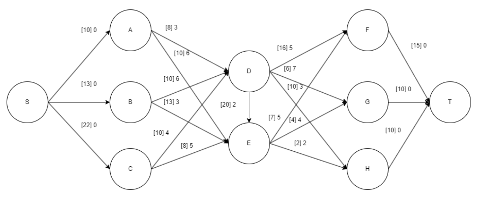

# Problem
W centrum dyspozytorskim planuje się dostawy węgla z określonych kopalń do elektrowni.
Rozważana jest możliwość dostaw węgla kamiennego z trzech kopalń A, B, C do trzech elektrowni
F, G, H za pomocą sieci kolejowej z dwoma stacjami pośrednimi D i E. 
Jednostkowe koszty transportowe i przepustowości na poszczególnych odcinkach wynoszą
(koszt, przepustowość):

        D           E       F       G       H
A       3,8         6,10    -       -       -
B       6,10        3,13    -       -       -
C       4, 10       5,8     -       -       -
D       -           2,20    5,16    7,6     3,10
E       -           -       5,7     4,4     2, 2 

* Zdolności wydobywcze kopalń wynoszą (w tys. ton): WA = 10, WB = 13, WC = 22.
* Średnie zużycie dobowe węgla przez elektrownie wynosi (w tys. ton): ZF = 15, ZG = 10, ZH = 10.
Zadanie polega na wyznaczeniu planu codziennych dostaw węgla zaspokajający zapotrzebowania
elektrowni i minimalizujący sumaryczne koszty transportu. W tym celu należy:

# Sieć przepływowa

